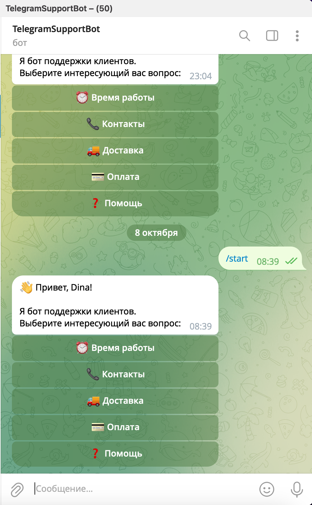
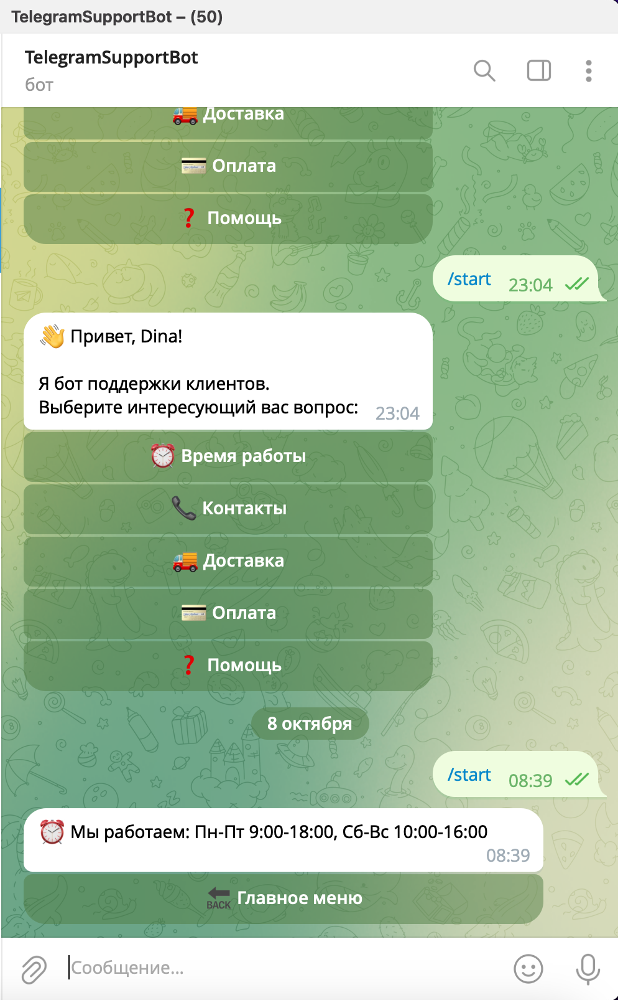
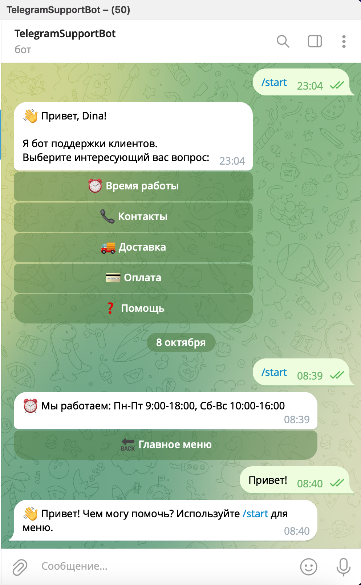

# Telegram Support Bot

A simple and responsive Telegram bot for customer support, built with **Python** and the `python-telegram-bot` framework.  
It provides quick answers to FAQs, contact information, working hours, and supports interactive buttons.

---

## Features
- Interactive menu with inline buttons  
- Auto-replies to user messages  
- Contact and delivery info  
- Simple, clean, and extendable structure  

---

## Tech Stack
- **Python 3.10+**
- **python-telegram-bot v21**
- **Logging** for debugging and monitoring

---

---

## Screenshots

Here are a few screenshots showing how the bot works in Telegram:

<div align="center">
  
  
  
</div>

---


##️ Setup

1. Clone the repository:
   ```bash
   git clone https://github.com/dinywka/telegram-support-bot
   cd telegram-support-bot
